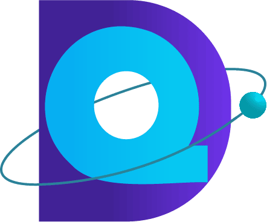

#  Hi, I'm __Daniel Quintero Henriquez__  

##  I'm a __Systems Analyst and Web Developer__ 

 

### __🔥 I am passionate about music 🎵 , science 🧑‍🔬, and technology 🤖__, and I enjoy immersing myself in the world of continuous learning 🧠. As a __graduate of SENA and a technologist in analysis and systems development__, I have a solid foundation in creating innovative solutions. 😁 I had the privilege of __being part of the Oracle Next Education program__, which allowed me to expand my knowledge and skills in the field of technology. I love staying up to date with the latest technological trends and working in collaborative teams. My approach is centered around developing creative solutions driven by innovation, and I am excited to apply my skills to challenging projects. 🧐 I am committed to success and constant growth, and __I am enthusiastic about contributing to the technology world through my passion and expertise__; do you want to meet me?

 

 

## 👾 My Statistics

 

## 📚 Languajes
 

 
 
 
 
 

## 🤖 Tools I use the most
 

